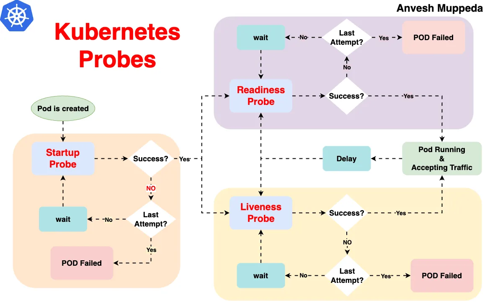

# Kubernetes


# O que é o Kubernets

Também conhecido como ks8, é uma plataforma de orquestração de container, com o seu principal foco na escalabilidade dentro de clusters.

## Estrutura


### Kubelet

Responsável por saber o que está acontecendo em cada nó(cada servidor do seu cluster), ele é o responsável por falar com o containerd, que por sua vez fala com o runc. No final das contas ele é como se fosse um Docker.

### Kube-proxy

Facilita a comunicação entre os componentes do Kubernetes, garantindo que as requisições sejam roteadas corretamente para os pods certos.

### Workers

Sãos os nós que executam os containers

### Pods

A menor unidade de execução no Kubernetes é o **pod**, não o container. Um pod encapsula um ou mais containers que compartilham recursos e são sempre programados juntos no mesmo nó. Para detalhes completos sobre pods, ciclo de vida e configurações, consulte a seção de Conceitos.

### Control Plane

É um dos nós do cluster que faz o gerenciamento dos nós, inclusive é ideal ter redundância desse cara, porque se ele cair nossos nós ficam sem um controlador. Importante deixar um nó específico para esse cara, porque até da para rodar worker junto com o controle Plane, mas não é uma boa.

**ETCD:** banco de dados chave valor que guarda todas as informações sobre o cluster, se tu criou um cluster na mão e não usa um agente da nuvem tem que tomar cuidado com esse cara.

**Scheduler:** responsável por dizer qual nó vai hospedar qual pod, com base nas metricas de hardware

**Controller Manager:** verifica a integridade dos nós, para garantir que está tudo no ar com a quantidade de instancias definidas. Se não tiver ele se encarrega de ajustar.

**API Server:** ele é a porta de entrada, todo mundo comunica com ele, e ele chama os outros serviços, e ele é realmente uma API http, as ferramenats como o kubectl apenas pegam os dados dessas chamadas http e mostram de uma forma mais fácil de se ler e trabalhar.

### Estrutura por debaixo dos panos - containerd / runc

Na prática, o k8s precisa de um container engine e um container runtime, e cai na treta de são suportar Docker, na prática o Docker tem muita coisa que o ks8 não precisa, então ele usa o container runtime [containerd](https://containerd.io/), que é a mesma coisa que o Docker usa no final das contas. Obs. tem conceitos de container runtime de baixo e alto nível, o containerd é de alto, e existe o runc que é o de baixo nível, responsável por falar com o kernel.


## Conceitos

### Pods

Não podemos falar que o worker executa um container, no k8s, a menor unidade se chama **pod**, dentro dele pode ter um ou mais container.
Um exemplo de uso de pod com mais de um container, é a ideia de sidecar.

Outro ponto importante, é que eles tem um namespace de rede compartilhado entre eles, então eles conseguem se comunicar via localhost.

#### Ciclo de vida

 

O ciclo de vida de um Pod no Kubernetes passa por diferentes estados:
1. **Pending**: O pod foi aceito pelo cluster, mas um ou mais containers ainda não estão prontos para execução
2. **Running**: Todos os containers foram criados e pelo menos um está em execução
3. **Succeeded**: Todos os containers terminaram com sucesso e não serão reiniciados
4. **Failed**: Todos os containers terminaram e pelo menos um falhou
5. **Unknown**: Por alguma razão, o estado do pod não pode ser obtido


#### Desligamento - Graceful Shutdown

Na configuração do Pod tu podes alterar esse tempo padrão de espera até a aplicação desligar e fechar conexões.

```yaml
spec:
  terminationGracePeriodSeconds: 60
```

Se quiseres saber mais sobre o assunto, consulte a documentação [Container Lifecycle Hooks](https://kubernetes.io/docs/concepts/containers/container-lifecycle-hooks/).

##### Processo de Desligamento no Kubernetes

Quando um Pod é encerrado no Kubernetes, o sistema segue estas etapas:

1. **SIGTERM** - Envia sinal SIGTERM para o container
2. **Período de Graceful** - Aguarda o tempo definido em `terminationGracePeriodSeconds` (padrão: 30s)
3. **SIGKILL** - Envia SIGKILL se o container não encerrar no tempo definido

O período de graceful permite que a aplicação:
- Finalize requisições em andamento
- Feche conexões com bancos de dados
- Libere recursos e locks
- Salve estados e cache

##### Capturando Sinais em Aplicações

Para implementar o graceful shutdown, sua aplicação deve capturar o sinal SIGTERM:

- **Node.js**: Use `process.on('SIGTERM', callback)` para detectar o sinal e fechar conexões
- **C# (.NET)**: Utilize `CancellationToken` nos serviços e configure `UseShutdownTimeout`
- **Java**: Implemente um `Runtime.getRuntime().addShutdownHook(Thread)`
- **Go**: Use `signal.Notify()` para capturar sinais e iniciar o desligamento

##### Boas Práticas

- Ajuste o `terminationGracePeriodSeconds` conforme a necessidade real da aplicação
- Implemente handlers para SIGTERM em todas as aplicações
- Monitore logs durante o processo de desligamento
- Use probes de readiness/liveness em conjunto com o graceful shutdown

### Deployment

O objetivo principal do Deployment é gerenciar a criação e atualização de Pods no cluster. Em produção, nunca se cria Pods diretamente, mas sim através de Deployments, que garantem:

- Criação automática do número desejado de réplicas
- Recuperação automática em caso de falhas
- Atualizações controladas sem downtime (rolling updates)
- Rollback para versões anteriores quando necessário

Indicado para aplicações stateless, como serviços web, APIs e microserviços.

**Nota:** Deployment, StatefulSet e DaemonSet são todos controladores no Kubernetes, cada um com finalidade específica para diferentes tipos de aplicações.

#### StatefulSets

Indicado para aplicações que precisam manter estado. Fornece:

- Identificadores de rede estáveis e previsíveis
- Armazenamento persistente que sobrevive a reinicializações
- Ordenação garantida na implantação e escalonamento
- Nomes de pods persistentes (app-0, app-1, app-2)

Casos de uso típicos: bancos de dados distribuídos, sistemas de mensageria e aplicações que exigem inicialização sequencial.

#### DaemonSet

Um DaemonSet é indicado quando você precisa garantir que uma cópia de um pod seja executada em cada nó do cluster (ou em nós específicos que atendam a certos critérios). Casos de uso típicos incluem:

- Coleta de logs - como Fluentd, Logstash
- Monitoramento de nós - como Prometheus Node Exporter, collectd
- Agentes de segurança - como Falco, Sysdig
- Armazenamento - como Ceph, GlusterFS
Os DaemonSets garantem que, mesmo quando novos nós são adicionados ao cluster, os pods necessários serão automaticamente implantados neles.

### ReplicaSet

O ReplicaSet garante que um número especificado de réplicas de Pods esteja em execução a qualquer momento. Suas principais funções são:

- Manter o número desejado de Pods sempre disponíveis
- Recriar Pods automaticamente em caso de falhas 
- Fornecer alta disponibilidade para aplicações

O ReplicaSet não implementa estratégias de atualização (como RollingUpdate ou Recreate), pois essa funcionalidade é fornecida pelo Deployment. É por isso que, embora seja possível usar ReplicaSets diretamente, na prática raramente são manipulados manualmente. O Deployment gerencia ReplicaSets para implementar atualizações controladas e rollbacks.


### Services

O Service é um recurso fundamental do Kubernetes que atua como um ponto de acesso estável para seus pods, resolvendo o problema de comunicação tanto entre aplicações dentro do cluster quanto com o mundo externo. Ele funciona como um balanceador de carga interno, permitindo que aplicações se comuniquem de forma confiável entre si e que usuários externos acessem seus serviços, independentemente de onde os pods estejam rodando.

Além de ser um balanceador de carga, o Service também atua como um mecanismo de service discovery, fornecendo um nome DNS estável dentro do cluster. Isso significa que as aplicações podem se comunicar entre si usando apenas o nome do serviço, sem precisar conhecer IPs ou portas específicas dos pods. Ele opera na camada 4 (TCP/UDP) do modelo OSI, sendo o ponto único de entrada para um conjunto de pods, simplificando a configuração de rede e segurança.


**Cluster IP:** é o tipo padrão de Service, onde você tem um IP fixo dentro do cluster que serve como ponto único de acesso para seus pods. Toda comunicação interna entre serviços deve passar por esse IP, não sendo possível acessar os pods diretamente. Ideal para comunicação entre serviços dentro do cluster.

**Node Port:** expõe o serviço em uma porta específica (entre 30000-32767) em todos os nós do cluster. Cada nó redireciona o tráfego dessa porta para o serviço. Não é recomendado para produção pois:
- Expõe portas em todos os nós, aumentando a superfície de ataque
- O range de portas disponível é limitado (30000-32767)
- Em clusters grandes, gerenciar múltiplos NodePorts pode se tornar complexo
- Não oferece recursos avançados de balanceamento de carga

**Load Balancer:** é o tipo mais completo de serviço, que provisiona um balanceador de carga externo ao cluster. Diferente do NodePort que expõe o serviço em todos os nós, o Load Balancer:
- Cria um único ponto de entrada externo para o serviço
- Distribui automaticamente o tráfego entre os nós do cluster
- Oferece recursos avançados de balanceamento de carga
- Requer suporte do cloud provider (AWS, Azure, GCP, etc.)
- Cada serviço do tipo LoadBalancer cria uma nova instância de balanceador de carga no provedor
- Bastante custoso, e o ingress resolve o problema de forma mais eficiente na maioria dos casos.
- O Load Balancer opera na camada 4 (TCP/UDP) do modelo OSI, enquanto o Ingress opera na camada 7 (HTTP/HTTPS)
- Ideal para serviços que precisam de controle granular de TCP/UDP ou quando o Ingress não é suficiente


### Ingress

Quando se tem mais de um service, você pode usar o ingress, pois ele é uma camada acima dos serviços, é como se fosse um proxy reverso para os services, e esse cara pode ser até mesmo um Nginx, aí cada rota ou sub-dominio pode ser recdirecioando para o seu respectivo "service"


E você pode também aninhar várias coisas, você pode ter de baixo desse proxy reverso(ingress) um API Gatway, ou outros serviços, até conseguir chegar no seu Pod.


### Namespace

Server como um espaço logico de separação dos recursos, ajudando a organizar, e controlar os acessos. Muito comum para separar por aplicações, ou até mesmo por ambientes(homologação, produção, ...), o que não é o ideal, pois teremos ambientes não produtivos impactando produção em alguns momentos.


Por padrão se não for informado, ao criar um novo pod ele sempre será criado no **namespace defaut**, mas tamb;em temos alguns outros que são criados:

- kube-system: usado para administração do cluster, API Server, Control Pane...
- kube-public: armazena informações visíveis publicamente a todos os usuários do cluster
- kube-node-lease: contém objetos de lease para cada nó, usados para monitorar disponibilidade


### Init Conainers

Containers que executam antes do container principal do pod, garantindo pré-requisitos.
- Completam totalmente antes dos containers principais iniciarem
- Preparam o ambiente para a aplicação principal
- Configuram dependências, inicializam dados
- Verificam disponibilidade de serviços externos
- Executam em sequência, um após o outro


Para testar o conceito de Init Containers na prática, explore o exemplo em [init-containers.yaml](./00-Yaml%20Basico/init-containers.yaml), que demonstra um Init Container que aguarda 60 segundos e gera conteúdo para um servidor web nginx. Execute com:

```bash
kubectl apply -f init-containers.yaml
kubectl get pods -w   # Observe o estado "Init" por 40 segundos
```

### Multi-Container Pods

Pods podem conter mais de um container, compartilhando recursos como volumes e rede.
- Todos os containers no pod compartilham o mesmo IP e namespace de rede
- Containers podem se comunicar via localhost
- Compartilham o mesmo ciclo de vida (criados e destruídos juntos)

Para testar o conceito de Multi-Container Pods na prática, explore o exemplo em [templates/pods/multi-container-pod.yaml](./templates/pods/multi-container-pod.yaml), que demonstra três containers compartilhando um volume. Execute com:

```bash
kubectl apply -f templates/multi-container-pod.yaml
kubectl logs multi-container-pod -c container-monitor  # Veja logs do container específico
```

### Probes - Health Check

É uma forma de o próprio cluster identificar se o cluster está saudável, e dependendo da ação conseguir fazer o __self healing__, e manter tudo rodando corretamente. E quem vai fazer essa validação dentro de cada nó, é o Kubelet. 

A forma mais simples de fazer isso é usado um endpoint HTTP de health check.


Existem alguns tipos de validações de health check no k8s para garantir que o seu __pod__ esta funcionando corretamente.
- **Startup**: Dá um tempo maior pro container inicializar antes de começar a aplicar os outros probes
- **Readiness**: Se o container não estiver pronto para receber requisições, ele é removido temporariamente do service. Ex: aplicação ainda carregando configurações; banco de dados não conectado; cache não inicializado...
- **Liveness**: Se o container não estiver respondendo, ele é reiniciado automaticamente



Para testar o conceito de Probes na prática, explore o exemplo em [templates/probes/probes.yaml](./templates/probes/probes.yaml), que demonstra os três tipos de probes (liveness, readiness e startup) configurados em um deployment com nginx. Execute com:

```bash
kubectl apply -f templates/probes.yaml
kubectl describe $(kubectl get pods -l app=nginx-probes -o name)  # Verifique as configurações dos probes
```

### Jobs e CronJobs

#### Jobs

Jobs são recursos que executam uma tarefa até sua conclusão bem-sucedida.
- Executam tarefas finitas (com início e fim definidos)
- Garantem que a tarefa seja concluída com sucesso
- Mantem registro dos pods após conclusão
- Ideais para processamento em lote, migrações e cálculos extensos

#### CronJobs

CronJobs são jobs que executam em horários específicos, seguindo uma programação definida.
- Usam a sintaxe cron padrão do Unix: `* * * * *` (minuto, hora, dia do mês, mês, dia da semana)
- Criam objetos Job automaticamente nos horários programados
- Ideais para backups, relatórios e tarefas de manutenção periódicas

#### Comandos principais:

- Listar Jobs: `kubectl get jobs`
- Listar CronJobs: `kubectl get cronjobs` ou `kubectl get cj`
- Criar um Job/CronJob: `kubectl apply -f job.yaml`
- Ver detalhes: `kubectl describe job nome-do-job` ou `kubectl describe cronjob nome-do-cronjob`
- Excluir: `kubectl delete job nome-do-job` ou `kubectl delete cronjob nome-do-cronjob`

Para testar estes conceitos na prática, explore os exemplos em [templates/jobs/job.yaml](./templates/jobs/job.yaml) e [templates/jobs/cronjob.yaml](./templates/jobs/cronjob.yaml).


## Criação de um cluster

Dicas de ferramentas que você pode usar em usa máquina local para fazer testes com k8S.

- [Play with Kubernetes](https://labs.play-with-k8s.com/): Ferramenta online e gratuita para brincar com k8s, mas com limitação de até 4hrs, após isso ela apaga tudo e você precisa iniciar do zero.

- [Kind](https://kind.sigs.k8s.io/): ideal para rodar em uma maquina local
  - Para instruções detalhadas sobre como configurar e rodar clusters com Kind, consulte o [readme sobre como usar o Kind](./cluster-kind/README.md)

- [Minikube](https://minikube.sigs.k8s.io/docs/start/)

- [K3S](https://k3s.io/)

## Comandos

### Kubctl

Essa é a ferramenta de linha de comando que geralmente é usada para comunicação com o cluster. [Como Install o kubctl.](https://pwittrock.github.io/docs/tasks/tools/install-kubectl/)

#### Trabalhando com Pods

- Listar todos os pods: `kubectl get pod -A -owide`

- Listar todos os nodes: `kubectl get node`

- Criação de um pod: `kubectl run --image nginx servidor-web`

- Criar um pod interativo: `kubectl run --image alpine --rm -it it-demo sh`

- Geração de um script yaml: `kubectl run --image nginx --dry-run=client -oyaml servidor-web`

- criar pod usando Yaml: `kubectl apply -f pod.yaml`

- Deletar um pod: `kubectl delete pod servidor-web`

Obs.: esses comandos devem ser usados apenas para testes, pois, todo o controle em produção deve ser feio via Deployment.

#### Deployment

Com a parte de deployment, se eu deletar um pod, ou ele _crashar_, o k8s já sobre uma outra instância na hora.

- Criação de um deployment: `kubectl create deployment --image nginx servidor-web`

- Criar um template de deployment: `k create deployment --image nginx servidor-web --dry-run -o yaml | kubectl neat > templates/deployment.yaml`

- Listar deployments: `kubectl get deployment`

- Listar replicasets: `kubectl get replicaset`

- Deletar um deploy: `kubectl delete deploy servidor-web`

- Editar um deployment em tempo real: `kubectl edit deploy servidor-web`
  - Abre o manifesto do deployment em um editor de texto
  - Alterações são aplicadas assim que o arquivo é salvo
  - Útil para ajustes rápidos como mudar imagem, recursos ou variáveis de ambiente

- Escalando meu deployment: `kubectl scale deployment servidor-web --replicas 5`. Para "desescalar", só rodar o comando novamente mudando o numero de replicas.

A parte de escala a gente faz de forma automática em produção, com ferramentas como o Keda e outras metricas de requests, infra...

**Nome dos Pods**: por padrão eles sempre vão ser: `{nome do deployment}-{hash do replicaset}-{hash aleatorio}`  
Exemplo: `nginx-7df484c9bc-j2kdp`

##### Rollouts

Rollouts são estratégias de atualização controlada para Deployments no Kubernetes. Eles permitem:

- Implementar novas versões sem interrupção do serviço
- Controlar a velocidade de substituição dos pods
- Reverter automaticamente em caso de falha
- Fazer rollback para versões anteriores quando necessário

**Estratégias de Rollout:**

- **RollingUpdate (padrão)**: Substitui pods antigos por novos gradualmente
- **Recreate**: Encerra todos os pods antigos antes de criar novos (causa indisponibilidade)

**Comandos principais:**

- Ver status de um rollout: `kubectl rollout status deployment/servidor-web`
- Pausar um rollout: `kubectl rollout pause deployment/servidor-web`
- Retomar um rollout: `kubectl rollout resume deployment/servidor-web`
- Ver histórico de revisões: `kubectl rollout history deployment/servidor-web`
- Ver histórico de revisões detalhado: `kubectl rollout history deployment/servidor-web -o yaml`
- Fazer rollback para versão anterior: `kubectl rollout undo deployment/servidor-web`
- Fazer rollback para versão específica: `kubectl rollout undo deployment/servidor-web --to-revision=2`

O nome sempre vai ser `deployment/{nome-do-deployment}`, mas também podes aplicar em daemonsets e statefulsets, só vais precisar mudar a parte unicial, exemplo: `daemonset/abc`


#### Logs e Events

##### Logs


- Visualizar logs de um pod: `kubectl logs <nome-do-pod>`
- Visualizar logs em tempo real (follow): `kubectl logs <nome-do-pod> -f`
- Visualizar logs de um container específico em pod com múltiplos containers: `kubectl logs <nome-do-pod> -c <nome-do-container>`
- Visualizar logs de todos os pods com uma label: `kubectl logs -l app=nginx`
- Visualizar últimas N linhas de logs: `kubectl logs <nome-do-pod> --tail=100`
- Visualizar logs desde uma certa duração: `kubectl logs <nome-do-pod> --since=1h`
- Visualizar logs de pods anteriores (se o pod foi reiniciado): `kubectl logs <nome-do-pod> --previous`

##### Events

- Listar todos os eventos: `kubectl get events`
- Listar eventos ordenados por timestamp: `kubectl get events --sort-by='.metadata.creationTimestamp'`
- Listar eventos em formato detalhado: `kubectl get events -o wide`
- Visualizar eventos de um namespace específico: `kubectl get events -n <namespace>`
- Listar apenas eventos de warning: `kubectl get events --field-selector type=Warning`
- Monitorar eventos em tempo real: `kubectl get events -w`
- Visualizar eventos em formato YAML/JSON: `kubectl get events -o yaml`