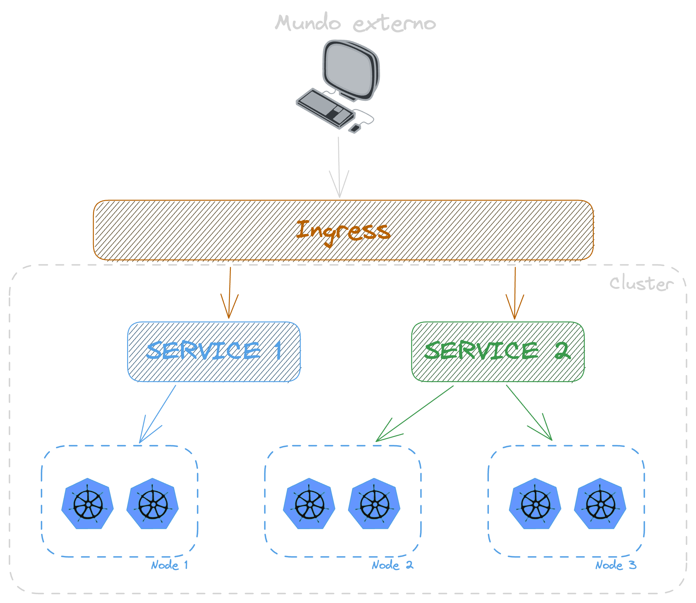

# Kubernetes

# O que é o Kubernets

Também conhecido como ks8, é uma plataforma de orquestração de container, com o seu principal foco na escalabilidade dentro de clusters.

## Estrutura

### Kubelet

Responsável por saber o que está acontecendo em cada nó(cada servidor do seu cluster), ele é o responsável por falar com o containerd, que por sua vez fala com o runc. No final das contas ele é como se fosse um Docker.

### Kube-proxy

Proxy que fica dentor do nó responsável pela comunicação com o cluster Kubernetes.

### Workers

Sãos os nós que executam os containers

### Pods

Não podemos falar que o worker executa um container, no k8s, a menor unidade se chama **pod**, dentro dele pode ter um ou mais container.

### Control Plane

É um dos nós do cluster que faz o gerenciamento dos nós, inclusive é ideal ter redundância desse cara, porque se ele cair nossos nós ficam sem um controlador. Importante deixar um nó específico para esse cara, porque até da para rodar worker junto com o controle Plane, mas não é uma boa.

**ETCD:** banco de dados chave valor que guarda todas as informações sobre o cluster, se tu criou um cluster na mão e não usa um agente da nuvem tem que tomar cuidado com esse cara.

**Scheduler:** responsável por dizer qual nó vai hospedar qual pod, com base nas metricas de hardware

**Controller Manager:** verifica a integridade dos nós, para garantir que está tudo no ar com a quantidade de instancias definidas. Se não tiver ele se encarrega de ajustar.

**API Server:** ele é a porta de entrada, todo mundo comunica com ele, e ele chama os outros serviços, e ele é realmente uma API http, as ferramenats como o kubectl apenas pegam os dados dessas chamadas http e mostram de uma forma mais fácil de se ler e trabalhar.

### Estrutura por debaixo dos panos - containerd / runc

Na prática, o k8s precisa de um container engine e um container runtime, e cai na treta de são suportar Docker, na prática o Docker tem muita coisa que o ks8 não precisa, então ele usa o container runtime [containerd](https://containerd.io/), que é a mesma coisa que o Docker usa no final das contas. Obs. tem conceitos de container runtime de baixo e alto nível, o containerd é de alto, e existe o runc que é o de baixo nível, responsável por falar com o kernel.

## Conceitos

### Deployment

Toda a configuração dos pods são feitas através deste controlador, instancias, imagens...

### ReplicaSet

Responsável por garantir a quantidade de pods em execução.

### Services

Ferramenta que facilita o acesso de serviços externos ao nosso nó/cluster, ele fica como se fosse um load balancer.

**Cluster IP:** esse é o padrão, onde você tem um Ip(fixo) para o cluster, e tudo passa por ali, não existe a possibilidade de chamar um Pod/nó diretamente. O importante é que você só consegue acesso se você estiver dentro do cluster, só para comunicação interna.

**Node Port:** aqui te da acesso direto a rede do teu serviço, direto no nó, não é muito bom usar isso no ambiente de produção, aqui tu já consegue ter acesso usando um serviço externo ao cluster. Quando se tem mais de um nó, aí já se torna problematico, porque você tem que saber o ip de todos... aí para isso temos a próxima solução.

**Load Balancer:** distribui as cargas entre os nós, diferentemente do Node Port onde você chama um nó especificamente, aqui você chama o balancer e ele se vira para redirecionar para o melhor nó. Importante, isso precisa ser implementado ou instalado, porque geralmente quem oferece esse tipo de service são os serviços de cloud provider.

### Ingress

Quando se tem mais de um service, você pode usar o ingress, pois ele é uma camada acima dos serviços, é como se fosse um proxy reverso para os services, e esse cara pode ser até mesmo um Nginx, aí cada rota ou sub-dominio pode ser recdirecioando para o seu respectivo "service"

E você pode também aninhar várias coisas, você pode ter de baixo desse proxy reverso(ingress) um API Gatway, ou outros serviços, até conseguir chegar no seu Pod.

---

## Ferramentas

### Criação de um cluster

Dicas de ferramentas que você pode usar em usa máquina local para fazer testes com k8S.

- [Play with Kubernetes](https://labs.play-with-k8s.com/): Ferramenta online e gratuita para brincar com k8s, mas com limitação de até 4hrs, após isso ela apaga tudo e você precisa iniciar do zero.

- [Kind](https://kind.sigs.k8s.io/): ideal para rodar em uma maquina local

- [Minikube](https://minikube.sigs.k8s.io/docs/start/)

- [K3S](https://k3s.io/)

Para iniciar um cluster com o kind, basta rodar o seguinte comando: `kind create cluster --config config.yaml`. O arquivo de config você pode baixar aqui -> [00-Yaml Basico](./00-Yaml%20Basico/)

Para deletar o cluster: `kind delete cluster`

### Kubctl

Essa é a ferramenta de linha de comando que geralmente é usada para comunicação com o cluster. [Como Install o kubctl.](https://pwittrock.github.io/docs/tasks/tools/install-kubectl/)

#### Trabalhando com Pods

- Listar todos os pods: `kubectl get pod -A -owide`

- Listar todos os nodes: `kubectl get node`

- Criação de um pod: `kubectl run --image nginx servidor-web`

- Geração de um script yaml: `kubectl run --image nginx --dry-run=client -oyaml servidor-web`

- criar pod usando Yaml: `kubectl apply -f pod.yaml`

- Deletar um pod: `kubectl delete pod servidor-web`

#### Deployment

Com a parte de deployment, se eu deletar um pod, ou eke _crashar_, o k8s já sobre uma outra instância na hora.

- Criação de um deployment: `kubectl create deployment --image nginx servidor-web`

- Listar deployments: `kubectl get deployment`

- Listar replicasets: `kubectl get replicaset`

- Deletar um deploy: `kubectl delete deploy servidor-web`

- Escalando meu deployment: `kubectl scale deployment servidor-web --replicas 5`. Para "desescalar", só rodar o comando novamente mudando o numero de replicas.

A parte de escala a gente faz de forma automática em produção, com ferramentas como o Keda e outras metricas de requests, infra...

#### Services

- Criando nosso deployment: `kubectl create deployment --image nginx --dry-run -oyaml servidor-web > servidor-web.yaml`

- Rodando: `kubectl apply -f servidor-web.yaml`

- Criar pod para testar comunicação: `kubectl run --image alpine -it ping sh`; Instala também o curl: `apk add curl`

Se eu pegar o ip usando `kubectl get pods -owide` eu até consigo chamar direto, mas esses ips mudam toda hora, e o nome também, pois podemos ter vários pods expalhados em vários nós, e como expliquei anteriormente, para resolver esse problema nós usamos o services.

**Criação de um service**

`kubectl expose deployment servidor-web --port 80 --target-port 80`

- Port: qual porta o nosso service(load balancer) vai escutar
- Target Port: a porta em que a chamada vai ser redirecionada na instancia(porta do container).

Esse cara também daria para ser criado via yaml.

- Listagem dos services: `kubectl get service`. Aqui você tem o ip "fixo" do cluster

- Obter o yaml depois de criado: `kubectl get service servidor-web -oyaml`

Dentro desse yaml ele tem a questão das labels, que é a forma que o service sua para saber para qual containers ele pode redirecionar as cargas! Para ver quais containers tem essas labels, só rodar `kubectl get pod --show-labels`.
Para obetr todos os pods que estão respondendo para esse service, roda o comando `kubectl get endpoints servidor-web`

Para fazer o teste de um pod chamando o outro, dentro do pod do alpine que rodou de modo "it", só chamar um `curl servidor-web`

Isso aqui tem que tomar cuidado, pois se o service estiver em outra namespace você precisa passar o nome completo, mas preciso estudar mais sobre o assunto para trazer o exemplo.

### Operators

Na prática, é um tipo de aplicação que qualquer um pode escrever e plugar no cluster Kubernets, e essa aplicação consegue ver e executar ações no seu cluster.

Um exemplo mais comum para quem é dev. é o KEDA(Kubernetes-based event driver autoscaler), que seu papel é basicamente ficar observando as filas/topicos e decidir quando escalar ou desescalar instâncias dos consumidores, só que ao invés de você criar essas dentro da sua aplicação, ou escalar na mão, existe um app, um operator que faz esse trabalho para você.

#### Níveis de operators

Dentro dos operadores podemos dividir eles em 5 níveis.

Uma lista com os principais operators você pode encontrar no [operatorhub.io](https://operatorhub.io/)
