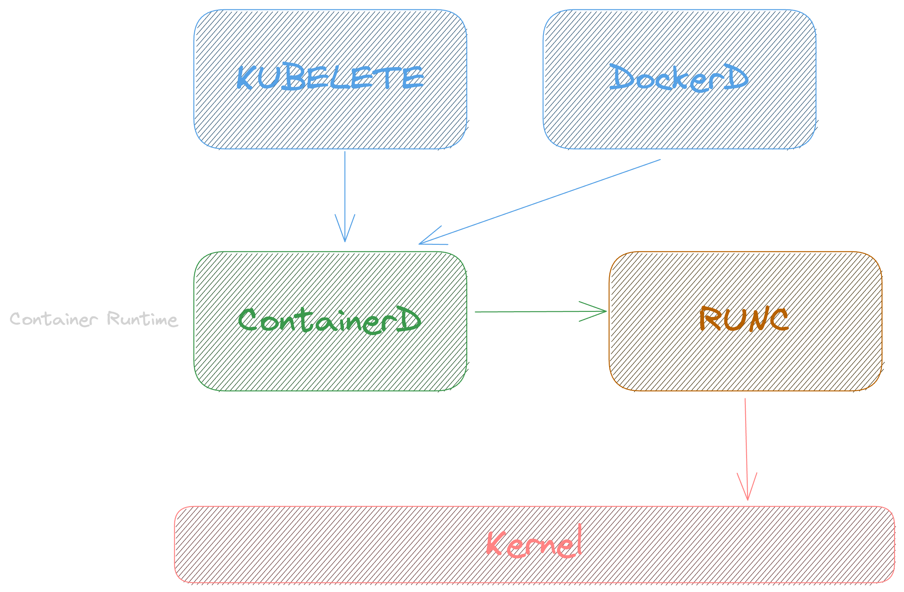

# Kubernetes


# O que é o Kubernets

Também conhecido como ks8, é uma plataforma de orquestração de container, com o seu principal foco na escalabilidade dentro de clusters.

## Estrutura


### Kubelet

Responsável por saber o que está acontecendo em cada nó(cada servidor do seu cluster), ele é o responsável por falar com o containerd, que por sua vez fala com o runc. No final das contas ele é como se fosse um Docker.

### Kube-proxy

Facilita a comunicação entre os componentes do Kubernetes, garantindo que as requisições sejam roteadas corretamente para os pods certos.

### Workers

Sãos os nós que executam os containers

### Pods

A menor unidade de execução no Kubernetes é o **pod**, não o container. Um pod encapsula um ou mais containers que compartilham recursos e são sempre programados juntos no mesmo nó. Para detalhes completos sobre pods, ciclo de vida e configurações, consulte a seção de Conceitos.

### Control Plane

É um dos nós do cluster que faz o gerenciamento dos nós, inclusive é ideal ter redundância desse cara, porque se ele cair nossos nós ficam sem um controlador. Importante deixar um nó específico para esse cara, porque até da para rodar worker junto com o controle Plane, mas não é uma boa.

**ETCD:** banco de dados chave valor que guarda todas as informações sobre o cluster, se tu criou um cluster na mão e não usa um agente da nuvem tem que tomar cuidado com esse cara.

**Scheduler:** responsável por dizer qual nó vai hospedar qual pod, com base nas metricas de hardware

**Controller Manager:** verifica a integridade dos nós, para garantir que está tudo no ar com a quantidade de instancias definidas. Se não tiver ele se encarrega de ajustar.

**API Server:** ele é a porta de entrada, todo mundo comunica com ele, e ele chama os outros serviços, e ele é realmente uma API http, as ferramenats como o kubectl apenas pegam os dados dessas chamadas http e mostram de uma forma mais fácil de se ler e trabalhar.

### Estrutura por debaixo dos panos - containerd / runc

Na prática, o k8s precisa de um container engine e um container runtime, e cai na treta de são suportar Docker, na prática o Docker tem muita coisa que o ks8 não precisa, então ele usa o container runtime [containerd](https://containerd.io/), que é a mesma coisa que o Docker usa no final das contas. Obs. tem conceitos de container runtime de baixo e alto nível, o containerd é de alto, e existe o runc que é o de baixo nível, responsável por falar com o kernel.



## Conceitos

### Pods

Não podemos falar que o worker executa um container, no k8s, a menor unidade se chama **pod**, dentro dele pode ter um ou mais container.
Um exemplo de uso de pod com mais de um container, é a ideia de sidecar.

Outro ponto importante, é que eles tem um namespace de rede compartilhado entre eles, então eles conseguem se comunicar via localhost.

#### Ciclo de vida

 

O ciclo de vida de um Pod no Kubernetes passa por diferentes estados:
1. **Pending**: O pod foi aceito pelo cluster, mas um ou mais containers ainda não estão prontos para execução
2. **Running**: Todos os containers foram criados e pelo menos um está em execução
3. **Succeeded**: Todos os containers terminaram com sucesso e não serão reiniciados
4. **Failed**: Todos os containers terminaram e pelo menos um falhou
5. **Unknown**: Por alguma razão, o estado do pod não pode ser obtido


#### Desligamento - Graceful Shutdown

Na configuração do Pod tu podes alterar esse tempo padrão de espera até a aplicação desligar e fechar conexões.

```yaml
spec:
  terminationGracePeriodSeconds: 60
```

Se quiseres saber mais sobre o assunto, consulte a documentação [Container Lifecycle Hooks](https://kubernetes.io/docs/concepts/containers/container-lifecycle-hooks/).

##### Processo de Desligamento no Kubernetes

Quando um Pod é encerrado no Kubernetes, o sistema segue estas etapas:

1. **SIGTERM** - Envia sinal SIGTERM para o container
2. **Período de Graceful** - Aguarda o tempo definido em `terminationGracePeriodSeconds` (padrão: 30s)
3. **SIGKILL** - Envia SIGKILL se o container não encerrar no tempo definido

O período de graceful permite que a aplicação:
- Finalize requisições em andamento
- Feche conexões com bancos de dados
- Libere recursos e locks
- Salve estados e cache

##### Capturando Sinais em Aplicações

Para implementar o graceful shutdown, sua aplicação deve capturar o sinal SIGTERM:

- **Node.js**: Use `process.on('SIGTERM', callback)` para detectar o sinal e fechar conexões
- **C# (.NET)**: Utilize `CancellationToken` nos serviços e configure `UseShutdownTimeout`
- **Java**: Implemente um `Runtime.getRuntime().addShutdownHook(Thread)`
- **Go**: Use `signal.Notify()` para capturar sinais e iniciar o desligamento

##### Boas Práticas

- Ajuste o `terminationGracePeriodSeconds` conforme a necessidade real da aplicação
- Implemente handlers para SIGTERM em todas as aplicações
- Monitore logs durante o processo de desligamento
- Use probes de readiness/liveness em conjunto com o graceful shutdown

### Deployment

O objetivo principal do Deployment é gerenciar a criação e atualização de Pods no cluster. Em produção, nunca se cria Pods diretamente, mas sim através de Deployments, que garantem:

- Criação automática do número desejado de réplicas
- Recuperação automática em caso de falhas
- Atualizações controladas sem downtime (rolling updates)
- Rollback para versões anteriores quando necessário

Indicado para aplicações stateless, como serviços web, APIs e microserviços.

**Nota:** Deployment, StatefulSet e DaemonSet são todos controladores no Kubernetes, cada um com finalidade específica para diferentes tipos de aplicações.

#### StatefulSets

Indicado para aplicações que precisam manter estado. Fornece:

- Identificadores de rede estáveis e previsíveis
- Armazenamento persistente que sobrevive a reinicializações
- Ordenação garantida na implantação e escalonamento
- Nomes de pods persistentes (app-0, app-1, app-2)

Casos de uso típicos: bancos de dados distribuídos, sistemas de mensageria e aplicações que exigem inicialização sequencial.

#### DaemonSet

Um DaemonSet é indicado quando você precisa garantir que uma cópia de um pod seja executada em cada nó do cluster (ou em nós específicos que atendam a certos critérios). Casos de uso típicos incluem:

- Coleta de logs - como Fluentd, Logstash
- Monitoramento de nós - como Prometheus Node Exporter, collectd
- Agentes de segurança - como Falco, Sysdig
- Armazenamento - como Ceph, GlusterFS
Os DaemonSets garantem que, mesmo quando novos nós são adicionados ao cluster, os pods necessários serão automaticamente implantados neles.

### ReplicaSet

O ReplicaSet garante que um número especificado de réplicas de Pods esteja em execução a qualquer momento. Suas principais funções são:

- Manter o número desejado de Pods sempre disponíveis
- Recriar Pods automaticamente em caso de falhas 
- Fornecer alta disponibilidade para aplicações

O ReplicaSet não implementa estratégias de atualização (como RollingUpdate ou Recreate), pois essa funcionalidade é fornecida pelo Deployment. É por isso que, embora seja possível usar ReplicaSets diretamente, na prática raramente são manipulados manualmente. O Deployment gerencia ReplicaSets para implementar atualizações controladas e rollbacks.


### Services

Ferramenta que facilita o acesso de serviços externos ao nosso nó/cluster, ele fica como se fosse um load balancer.


**Cluster IP:** esse é o padrão, onde você tem um Ip(fixo) para o cluster, e tudo passa por ali, não existe a possibilidade de chamar um Pod/nó diretamente. O importante é que você só consegue acesso se você estiver dentro do cluster, só para comunicação interna.

**Node Port:** aqui te da acesso direto a rede do teu serviço, direto no nó, não é muito bom usar isso no ambiente de produção, aqui tu já consegue ter acesso usando um serviço externo ao cluster. Quando se tem mais de um nó, aí já se torna problematico, porque você tem que saber o ip de todos... aí para isso temos a próxima solução.

**Load Balancer:** distribui as cargas entre os nós, diferentemente do Node Port onde você chama um nó especificamente, aqui você chama o balancer e ele se vira para redirecionar para o melhor nó. Importante, isso precisa ser implementado ou instalado, porque geralmente quem oferece esse tipo de service são os serviços de cloud provider.


### Ingress

Quando se tem mais de um service, você pode usar o ingress, pois ele é uma camada acima dos serviços, é como se fosse um proxy reverso para os services, e esse cara pode ser até mesmo um Nginx, aí cada rota ou sub-dominio pode ser recdirecioando para o seu respectivo "service"


E você pode também aninhar várias coisas, você pode ter de baixo desse proxy reverso(ingress) um API Gatway, ou outros serviços, até conseguir chegar no seu Pod.


### Namespace

Server como um espaço logico de separação dos recursos, ajudando a organizar, e controlar os acessos. Muito comum para separar por aplicações, ou até mesmo por ambientes(homologação, produção, ...), o que não é o ideal, pois teremos ambientes não produtivos impactando produção em alguns momentos.


Por padrão se não for informado, ao criar um novo pod ele sempre será criado no **namespace defaut**, mas tamb;em temos alguns outros que são criados:

- kube-system: usado para administração do cluster, API Server, Control Pane...
- kube-public: armazena informações visíveis publicamente a todos os usuários do cluster
- kube-node-lease: contém objetos de lease para cada nó, usados para monitorar disponibilidade


### Init Conainers

Containers que executam antes do container principal do pod, garantindo pré-requisitos.
- Completam totalmente antes dos containers principais iniciarem
- Preparam o ambiente para a aplicação principal
- Configuram dependências, inicializam dados
- Verificam disponibilidade de serviços externos
- Executam em sequência, um após o outro


Para testar o conceito de Init Containers na prática, explore o exemplo em [init-containers.yaml](./00-Yaml%20Basico/init-containers.yaml), que demonstra um Init Container que aguarda 60 segundos e gera conteúdo para um servidor web nginx. Execute com:

```bash
kubectl apply -f init-containers.yaml
kubectl get pods -w   # Observe o estado "Init" por 40 segundos
```

### Multi-Container Pods

Pods podem conter mais de um container, compartilhando recursos como volumes e rede.
- Todos os containers no pod compartilham o mesmo IP e namespace de rede
- Containers podem se comunicar via localhost
- Compartilham o mesmo ciclo de vida (criados e destruídos juntos)

Para testar o conceito de Multi-Container Pods na prática, explore o exemplo em [templates/multi-container-pod.yaml](./templates/multi-container-pod.yaml), que demonstra três containers compartilhando um volume. Execute com:

```bash
kubectl apply -f templates/multi-container-pod.yaml
kubectl logs multi-container-pod -c container-monitor  # Veja logs do container específico
```

#### Probes - Health Check

É uma forma de o próprio cluster identificar se o cluster está saudável, e dependendo da ação conseguir fazer o __self healing__, e manter tudo rodando corretamente. E quem vai fazer essa validação dentro de cada nó, é o Kubelet. 

A forma mais simples de fazer isso é usado um endpoint HTTP de health check.


__Liveness, Readiness e Startup__

## Criação de um cluster

Dicas de ferramentas que você pode usar em usa máquina local para fazer testes com k8S.

- [Play with Kubernetes](https://labs.play-with-k8s.com/): Ferramenta online e gratuita para brincar com k8s, mas com limitação de até 4hrs, após isso ela apaga tudo e você precisa iniciar do zero.

- [Kind](https://kind.sigs.k8s.io/): ideal para rodar em uma maquina local
  - Para instruções detalhadas sobre como configurar e rodar clusters com Kind, consulte o [readme sobre como usar o Kind](./cluster-kind/README.md)

- [Minikube](https://minikube.sigs.k8s.io/docs/start/)

- [K3S](https://k3s.io/)

## Comandos

### Kubctl

Essa é a ferramenta de linha de comando que geralmente é usada para comunicação com o cluster. [Como Install o kubctl.](https://pwittrock.github.io/docs/tasks/tools/install-kubectl/)

#### Trabalhando com Pods

- Listar todos os pods: `kubectl get pod -A -owide`

- Listar todos os nodes: `kubectl get node`

- Criação de um pod: `kubectl run --image nginx servidor-web`

- Criar um pod interativo: `kubectl run --image alpine --rm -it it-demo sh`

- Geração de um script yaml: `kubectl run --image nginx --dry-run=client -oyaml servidor-web`

- criar pod usando Yaml: `kubectl apply -f pod.yaml`

- Deletar um pod: `kubectl delete pod servidor-web`

Obs.: esses comandos devem ser usados apenas para testes, pois, todo o controle em produção deve ser feio via Deployment.

#### Deployment

Com a parte de deployment, se eu deletar um pod, ou ele _crashar_, o k8s já sobre uma outra instância na hora.

- Criação de um deployment: `kubectl create deployment --image nginx servidor-web`

- Criar um template de deployment: `k create deployment --image nginx servidor-web --dry-run -o yaml | kubectl neat > templates/deployment.yaml`

- Listar deployments: `kubectl get deployment`

- Listar replicasets: `kubectl get replicaset`

- Deletar um deploy: `kubectl delete deploy servidor-web`

- Editar um deployment em tempo real: `kubectl edit deploy servidor-web`
  - Abre o manifesto do deployment em um editor de texto
  - Alterações são aplicadas assim que o arquivo é salvo
  - Útil para ajustes rápidos como mudar imagem, recursos ou variáveis de ambiente

- Escalando meu deployment: `kubectl scale deployment servidor-web --replicas 5`. Para "desescalar", só rodar o comando novamente mudando o numero de replicas.

A parte de escala a gente faz de forma automática em produção, com ferramentas como o Keda e outras metricas de requests, infra...

**Nome dos Pods**: por padrão eles sempre vão ser: `{nome do deployment}-{hash do replicaset}-{hash aleatorio}`  
Exemplo: `nginx-7df484c9bc-j2kdp`

##### Rollouts

Rollouts são estratégias de atualização controlada para Deployments no Kubernetes. Eles permitem:

- Implementar novas versões sem interrupção do serviço
- Controlar a velocidade de substituição dos pods
- Reverter automaticamente em caso de falha
- Fazer rollback para versões anteriores quando necessário

**Estratégias de Rollout:**

- **RollingUpdate (padrão)**: Substitui pods antigos por novos gradualmente
- **Recreate**: Encerra todos os pods antigos antes de criar novos (causa indisponibilidade)

**Comandos principais:**

- Ver status de um rollout: `kubectl rollout status deployment/servidor-web`
- Pausar um rollout: `kubectl rollout pause deployment/servidor-web`
- Retomar um rollout: `kubectl rollout resume deployment/servidor-web`
- Ver histórico de revisões: `kubectl rollout history deployment/servidor-web`
- Fazer rollback para versão anterior: `kubectl rollout undo deployment/servidor-web`
- Fazer rollback para versão específica: `kubectl rollout undo deployment/servidor-web --to-revision=2`

O nome sempre vai ser `deployment/{nome-do-deployment}`, mas também podes aplicar em daemonsets e statefulsets, só vais precisar mudar a parte unicial, exemplo: `daemonset/abc`


**Configurações importantes no manifesto YAML:**

```yaml
spec:
  replicas: 3
  strategy:
    type: RollingUpdate
    rollingUpdate:
      maxSurge: 1        # Quantos pods a mais podem ser criados durante update
      maxUnavailable: 1  # Quantos pods podem ficar indisponíveis durante update
  minReadySeconds: 10    # Tempo mínimo para considerar um pod ready
```

#### Services

- Criando nosso deployment: `kubectl create deployment --image nginx --dry-run -oyaml servidor-web > servidor-web.yaml`

- Rodando: `kubectl apply -f servidor-web.yaml`

- Criar pod para testar comunicação: `kubectl run --image alpine -it ping sh`; Instala também o curl: `apk add curl`

Se eu pegar o ip usando `kubectl get pods -owide` eu até consigo chamar direto, mas esses ips mudam toda hora, e o nome também, pois podemos ter vários pods expalhados em vários nós, e como expliquei anteriormente, para resolver esse problema nós usamos o services.

**Criação de um service**

`kubectl expose deployment servidor-web --port 80 --target-port 80`

- Port: qual porta o nosso service(load balancer) vai escutar
- Target Port: a porta em que a chamada vai ser redirecionada na instancia(porta do container).

Esse cara também daria para ser criado via yaml.

- Listagem dos services: `kubectl get service`. Aqui você tem o ip "fixo" do cluster

- Obter o yaml depois de criado: `kubectl get service servidor-web -oyaml`

Dentro desse yaml ele tem a questão das labels, que é a forma que o service sua para saber para qual containers ele pode redirecionar as cargas! Para ver quais containers tem essas labels, só rodar `kubectl get pod --show-labels`.
Para obetr todos os pods que estão respondendo para esse service, roda o comando `kubectl get endpoints servidor-web`

Para fazer o teste de um pod chamando o outro, dentro do pod do alpine que rodou de modo "it", só chamar um `curl servidor-web`

Isso aqui tem que tomar cuidado, pois se o service estiver em outra namespace você precisa passar o nome completo, mas preciso estudar mais sobre o assunto para trazer o exemplo.

#### Namespaces 

- Listar namespaces: `kubectl get namespaces` ou `kubectl get ns`
- Listar pods de um namespace:  `kubectl get pod -n {namespace-name}`
- Criar um novo namespace: `kubectl create namespace {namespace-name}`
- Deletar um namespace: `kubectl delete namespace {namespace-name}`

A criação também podemos fazer com um YAML

- Para gerar o YAML da criação: `kubectl create ns {namespace-name} --dry-run -o yaml`
    - `kubectl create ns example --dry-run -o yaml | kubectl neat > namespace-example.yaml`
    - kubectl neate: precisa ser instalado a parte e serve para limpar manifestos YAML, removendo campos desnecessários e metadados gerados automaticamente pelo sistema. `kubectl krew install neat`
- Criar usando o YAML: `kubectl apply -f namespace-example.yaml`

#### Logs

- Listar os logs de um pod: `kubectl logs -n {namespace-name} {pod-name}`
- Seguir logs em tempo real: `kubectl logs -n {namespace-name} {pod-name} -f`
- Ver logs das últimas X linhas: `kubectl logs -n {namespace-name} {pod-name} --tail={quantidade}`
- Ver logs de um container específico em um pod: `kubectl logs -n {namespace-name} {pod-name} -c {container-name}`
- Ver logs com timestamp: `kubectl logs -n {namespace-name} {pod-name} --timestamps=true`
- Ver logs desde um determinado momento: `kubectl logs -n {namespace-name} {pod-name} --since=1h` (suporta s, m, h)

##### Describe

Em casos de erro, onde o contianer fica como pending e não sobe, podemos usar o describe para obter mais detalhes sobre o que está acontecendo.

```bash
kubectl describe pod {pod-name}
```

Esse comando vai te mostrar:
- O que aconteceu com o pod desde que ele foi criado
- Se teve algum erro ao puxar a imagem
- Se teve problema de recursos (CPU/memória)
- Se teve algum problema de scheduling
- Eventos recentes que aconteceram com o pod

Você também pode usar o describe para outros recursos:
- Services: `kubectl describe service {service-name}`
- Deployments: `kubectl describe deployment {deployment-name}`
- Namespaces: `kubectl describe namespace {namespace-name}`

Dica: se você quiser ver só os eventos recentes de todo o cluster, pode usar:
```bash
kubectl get events --sort-by='.lastTimestamp'
```

### Metadata, Labels e Selectors

#### Metadata

Todo recurso no Kubernetes possui metadata contendo informações sobre o objeto, como nome, namespace, anotações e labels. Essa metadata é crucial para identificação e organização dos recursos.

#### Labels

Labels são pares chave-valor anexados aos objetos que permitem categorizar e filtrar recursos. Por exemplo: `app: frontend`, `ambiente: producao`.

- Listar pods com suas labels: `kubectl get pods --show-labels`
- Filtrar por label: `kubectl get pods -l app=frontend`
- Adicionar label: `kubectl label pods meu-pod equipe=pagamentos`
- Remover label: `kubectl label pods meu-pod equipe-`

#### Selectors

Selectors são mecanismos para filtrar recursos com base em suas labels. São fundamentais para:

- Direcionar services para pods específicos
- Definir quais pods um ReplicaSet deve gerenciar
- Especificar alvos para deployments

Em um Service, o selector determina quais Pods receberão tráfego:

```yaml
spec:
  selector:
    app: backend
    tier: api
```

Os selectors podem ser de dois tipos:
- **Equality-based**: usando `=`, `==` ou `!=` (ex: `app=frontend`)
- **Set-based**: usando `in`, `notin`, `exists` (ex: `app in (frontend,backend)`)

Exemplos de uso:
- Filtrar pods por label: `kubectl get pods -l app=frontend`
- Usar múltiplos critérios: `kubectl get pods -l 'app=frontend,tier=web'`


## Ferramentas

### Operators

Na prática, é um tipo de aplicação que qualquer um pode escrever e plugar no cluster Kubernets, e essa aplicação consegue ver e executar ações no seu cluster.


Um exemplo mais comum para quem é dev. é o KEDA(Kubernetes-based event driver autoscaler), que seu papel é basicamente ficar observando as filas/topicos e decidir quando escalar ou desescalar instâncias dos consumidores, só que ao invés de você criar essas dentro da sua aplicação, ou escalar na mão, existe um app, um operator que faz esse trabalho para você.


#### Níveis de operators

Dentro dos operadores podemos dividir eles em 5 níveis.


Uma lista com os principais operators você pode encontrar no [operatorhub.io](https://operatorhub.io/)

### Goldilocks - VPA(Vertical Pod AutoScale)

O Goldilocks é uma ferramenta que ajuda a otimizar os recursos (CPU e memória) dos seus pods no Kubernetes através do VPA (Vertical Pod Autoscaler). Ele fornece recomendações para ajustar os requests e limits dos seus containers, ajudando a encontrar o "ponto ideal" de recursos.


#### O que é VPA?

O VPA (Vertical Pod Autoscaler) é um controlador que:
- Monitora o uso de recursos dos pods
- Fornece recomendações de ajuste de recursos
- Pode automaticamente ajustar os requests e limits dos pods
- Ajuda a evitar o provisionamento excessivo ou insuficiente de recursos

Para mais informações, consulte a [documentação oficial do Goldilocks](https://goldilocks.docs.fairwinds.com/).
